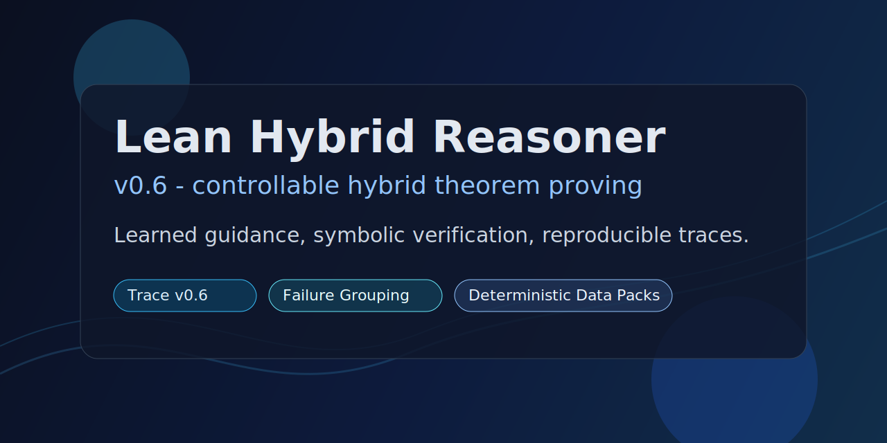
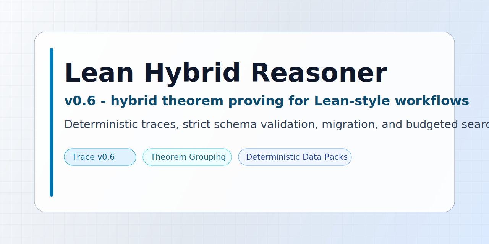
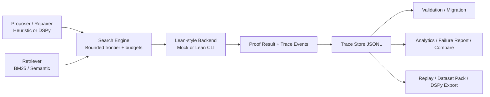

# Lean Hybrid Reasoner v0.6

Controllable hybrid theorem-proving research platform for Lean-style workflows.

Neural or heuristic modules can suggest tactics, but proof authority stays in the symbolic backend. The system is built for reproducible experimentation: bounded search, trace hardening, diagnostics, replay, dataset export, and regression-friendly CLI workflows.

## Social preview





**Tagline:** Learned guidance. Symbolic verification. Reproducible proof-search traces.

**Share copy:** Lean Hybrid Reasoner v0.6 is a controllable hybrid theorem-proving platform for Lean-style workflows with trace schema validation/migration, theorem-grouped failure triage, deterministic dataset packing, and budgeted search experiments.

Choose one style for GitHub Social Preview:

- Dark: [assets/social-preview.svg](assets/social-preview.svg)
- Light: [assets/social-preview-light.svg](assets/social-preview-light.svg)

Upload your chosen file in repository settings under Social preview.

## Why this project

- Hybrid architecture: learned guidance without giving up verifier authority.
- Experiment-first design: deterministic traces, budget controls, and comparators.
- Research-to-production bridge: migration and validation tooling for evolving trace schemas.

## v0.6 Highlights

- Versioned traces with `trace_schema_version: "0.6"` and `run_id`.
- Canonical event normalization with backward-compatible legacy keys.
- `validate-traces` for strict/non-strict schema validation.
- `migrate-traces` for upgrading legacy JSONL trace files.
- Failure triage enhancements including theorem-level grouping.
- Release helper script for repeatable smoke + test gate.

## Core capabilities

| Area | What you get |
| --- | --- |
| Search | Bounded branch exploration, duplicate pruning, stagnation controls, tactic-memory suppression |
| Retrieval | BM25 default, dependency-free semantic mode, optional sentence-transformers adapter |
| Diagnostics | Environment doctor, trace analytics, dashboard, failure classification |
| Data | Trace-to-training export and deterministic dataset packaging with quality filters |
| Experiments | Budget sweep, retrieval/profile grid, replay and trace comparison |

## Quick start

```bash
python -m venv .venv
source .venv/bin/activate
pip install -e ".[dev]"
pytest
```

Current expected status:

```text
61 tests passed
```

Optional extras:

```bash
pip install -e ".[dev,llm]"       # DSPy/LLM seams
pip install -e ".[dev,semantic]"  # sentence-transformers retrieval adapter
```

## CLI at a glance

### Health and setup

```bash
hybrid-proof doctor
hybrid-proof doctor --json
hybrid-proof snapshot-config --json
```

### Basic run loop

```bash
hybrid-proof list-theorems
hybrid-proof run --theorem add_zero_example
hybrid-proof run --theorem and_comm_example --print-trace
hybrid-proof eval
```

### Trace lifecycle

```bash
hybrid-proof validate-traces --input .runs/traces.jsonl
hybrid-proof validate-traces --input .runs/traces.jsonl --strict
hybrid-proof migrate-traces --input old_traces.jsonl --output traces_v06.jsonl
hybrid-proof trace-validate --path .runs/traces.jsonl
hybrid-proof trace-migrate --input old_traces.jsonl --output traces_v06.jsonl
```

### Analysis and experiments

```bash
hybrid-proof trace-summary
hybrid-proof trace-analytics
hybrid-proof failure-report --group-by theorem
hybrid-proof compare-traces --left .runs/baseline.jsonl --right .runs/variant.jsonl
hybrid-proof budget-sweep
hybrid-proof experiment-grid --budget-profiles tiny,starter,wide --retrieval-modes bm25,semantic
```

### Replay and data generation

```bash
hybrid-proof replay --index -1 --verify-with-lean --json
hybrid-proof trace-export-dspy --include-failures --output .runs/dspy_examples_with_failures.jsonl
hybrid-proof pack-dataset --include-failures --min-quality accepted --output-dir .runs/dataset_pack_accepted
```

## Budget profiles

```text
tiny       shallow smoke-test budget
starter    default development budget
wide       more branch exploration
deep       deeper proof chains
aggressive large local search budget
```

Practical tuning rule: increase `max_total_tactics` and `max_branches` before depth for most hard cases.

## Architecture



## Release gate

Run the v0.6 release helper:

```bash
bash scripts/release_v06_check.sh
```

Checklist reference:

- `RELEASE_CHECKLIST.md`

## Notes

- Mock backend is the default for deterministic control-loop validation.
- Failure categories are heuristic triage signals, not proof correctness guarantees.
- Lean/kernel acceptance remains the source of truth.
